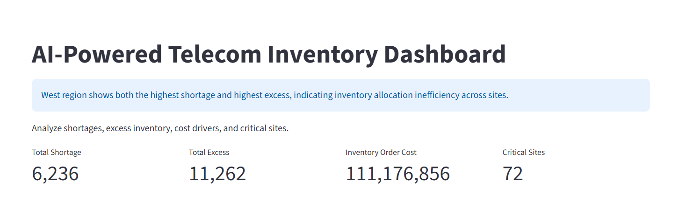
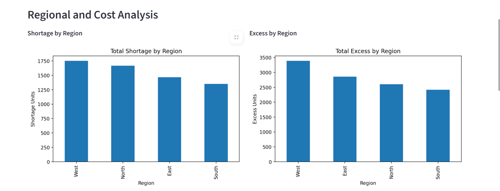
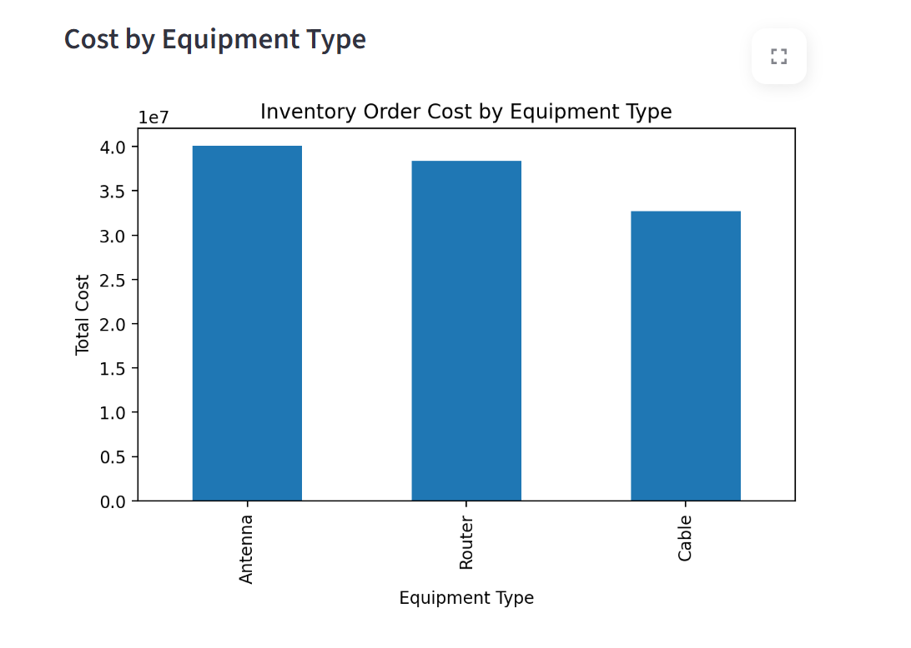
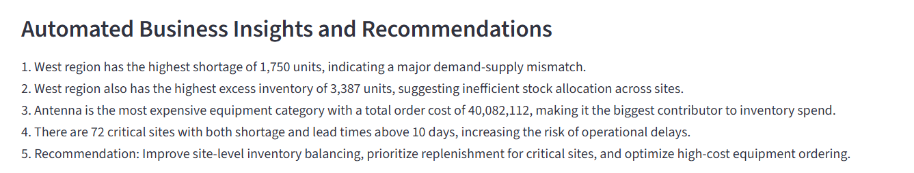
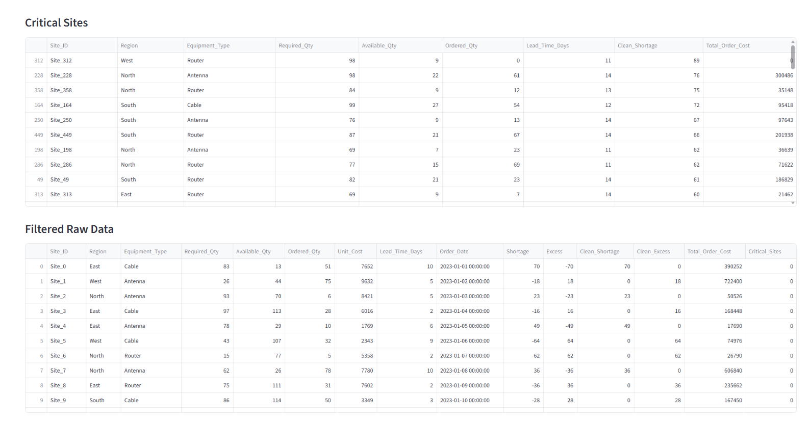

# AI-Powered Telecom Inventory and Cost Optimization Dashboard

## Project Overview
This project is an AI-powered telecom inventory and cost optimization dashboard inspired by real telecom ordering operations (Ericsson domain). It analyzes site-level inventory demand, stock availability, equipment cost, and lead-time risk to identify shortages, excess stock, and critical sites.

## Problem Statement
In telecom operations, poor inventory planning leads to:
- shortage of equipment at sites (project delays)
- excess inventory (increased holding cost)

This project identifies both problems and converts them into actionable insights.

## Features
- Region-wise shortage analysis
- Region-wise excess inventory analysis
- Equipment-wise inventory cost analysis
- Identification of critical sites (shortage + high lead time)
- Automated business insights and recommendations
- Interactive Streamlit dashboard with filters

## Tech Stack
- Python
- Pandas
- Jupyter Notebook
- Streamlit
- Matplotlib
- Excel

## Key Insights
- West region had the highest shortage
- West region also had the highest excess inventory (allocation inefficiency)
- Antenna was the highest cost driver
- 72 critical sites identified (shortage + high lead time)

## How to Run
1. Place `telecom_inventory.xlsx` inside the `data` folder
2. Run:

```bash
py -3.12 -m streamlit run app/dashboard.py

```

## Business Impact
This project demonstrates how data analysis can move beyond reporting and directly support decision-making in inventory planning, cost optimization, and operational risk reduction.

## Author
Megha

## Dashboard Preview

### Top Overview


### Charts




### Tables and Insights


